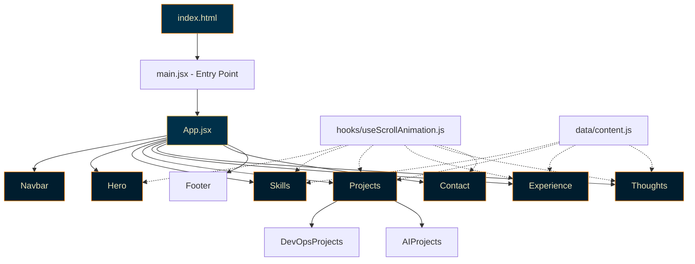
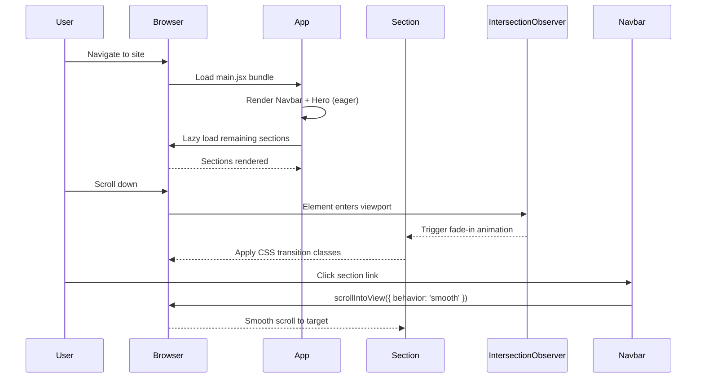

# Design Document: Portfolio Website

## Overview

A personal portfolio website for a Software Engineer specializing in DevOps, built with React (Vite) and Tailwind CSS. The site features a warm, moody dark aesthetic with a deep navy (#003049) base and red (#D62828), orange (#F77F00), and gold (#FCBF49) accents. Typography uses geometric sans-serif (Outfit) for headings and Inter for body text. It is organized into six main sections — Hero/About, Skills, Projects (DevOps & AI subsections), Experience, Thoughts (blog-like), and Contact — all rendered as functional React components in a responsive-first, single-page layout. The mood is warm, approachable, and deeply androgynous — confident but not aggressive.

The architecture prioritizes minimal bundle size through code splitting, lazy loading of below-the-fold sections, and zero unnecessary dependencies. Intersection Observer drives scroll animations natively, avoiding heavy animation libraries. The component tree is flat and composable, with each section as an independent module for easy maintenance and reordering.

## Architecture




## Main User Flow



## Project Structure

```
src/
├── main.jsx                  # Entry point
├── App.jsx                   # Root component, section layout
├── index.css                 # Tailwind directives, custom fonts
├── components/
│   ├── Navbar.jsx            # Sticky navigation
│   ├── Hero.jsx              # Hero/About section
│   ├── Skills.jsx            # Skills grid
│   ├── Projects.jsx          # Projects wrapper with tabs
│   ├── ProjectCard.jsx       # Reusable project card
│   ├── Experience.jsx        # Timeline/cards
│   ├── ExperienceCard.jsx    # Single experience entry
│   ├── Thoughts.jsx          # Blog-like listing
│   ├── ThoughtCard.jsx       # Single thought/article card
│   ├── Contact.jsx           # Contact form/info
│   └── Footer.jsx            # Footer
├── hooks/
│   └── useScrollAnimation.js # IntersectionObserver hook
└── data/
    └── content.js            # All static content/data
```

## Components and Interfaces

### Component: Navbar

**Purpose**: Sticky top navigation bar with smooth-scroll links to each section. Highlights the active section based on scroll position.

```jsx
// Props: none (reads section IDs from internal config)
// State: activeSection (string)
function Navbar() {
  // Tracks which section is in viewport via IntersectionObserver
  // Renders: <nav> with <a href="#sectionId"> links
  // Behavior: onClick → scrollIntoView({ behavior: 'smooth' })
}
```

**Responsibilities**:
- Render navigation links for all six sections
- Highlight active section link based on scroll position
- Remain fixed/sticky at top of viewport
- Collapse to hamburger menu on mobile (< 768px)

### Component: Hero

**Purpose**: Full-viewport landing section with name, title, brief intro, and call-to-action button.

```jsx
// Props: none (content from data/content.js)
function Hero() {
  // Renders: name with warm animated underline accent
  // Title: "Software Engineer | DevOps Specialist"
  // CTA button scrolls to Contact section
}
```

**Responsibilities**:
- Display name with a warm animated accent (e.g., gold underline sweep)
- Show title and brief intro paragraph
- Render CTA button (red #D62828, orange #F77F00 hover) that smooth-scrolls to Contact
- Full viewport height on all screen sizes

### Component: Skills

**Purpose**: Grouped display of technical skills organized by category.

```jsx
// Props: none (reads from data/content.js)
function Skills() {
  // Renders skill categories as groups
  // Each skill rendered as a warm-styled tag/badge
  // Categories: DevOps Tools, Cloud, CI/CD, Languages, etc.
}
```

**Responsibilities**:
- Group skills by category
- Render each skill as a styled badge with gold (#FCBF49) text on dark navy
- Highlight key DevOps skills (Terraform, CI/CD tools, AWS, Docker, Process Improvement)
- Fade-in animation on scroll via `useScrollAnimation`

### Component: Projects

**Purpose**: Wrapper component with tab navigation between DevOps and AI project subsections.

```jsx
// Props: none (reads from data/content.js)
// State: activeTab ('devops' | 'ai')
function Projects() {
  // Renders tab buttons for DevOps / AI
  // Filters and displays ProjectCard components based on active tab
}
```

### Component: ProjectCard

**Purpose**: Reusable card for displaying a single project.

```jsx
// Props:
//   title: string
//   description: string
//   tags: string[]
//   link: string (optional)
//   image: string (optional)
function ProjectCard({ title, description, tags, link, image }) {
  // Renders: card with hover animation (orange border glow)
  // Tags displayed as warm gold badges
  // Optional external link icon
}
```

### Component: Experience

**Purpose**: Work history displayed as a vertical timeline or card list.

```jsx
// Props: none (reads from data/content.js)
function Experience() {
  // Renders ExperienceCard for each entry
  // Vertical timeline line connecting entries
  // Alternating left/right layout on desktop
}
```

### Component: ExperienceCard

```jsx
// Props:
//   company: string
//   role: string
//   period: string
//   description: string
//   technologies: string[]
function ExperienceCard({ company, role, period, description, technologies }) {
  // Single experience entry with date badge and tech tags
}
```

### Component: Thoughts

**Purpose**: Blog-like section for articles and opinions.

```jsx
// Props: none (reads from data/content.js)
function Thoughts() {
  // Renders ThoughtCard for each article
  // Grid layout, 1 col mobile / 2 col tablet / 3 col desktop
}
```

### Component: ThoughtCard

```jsx
// Props:
//   title: string
//   excerpt: string
//   date: string
//   readTime: string
//   link: string (optional)
function ThoughtCard({ title, excerpt, date, readTime, link }) {
  // Card with title, excerpt preview, date, and estimated read time
}
```

### Component: Contact

**Purpose**: Contact information and/or form with social links.

```jsx
// Props: none
// State: formData ({ name, email, message }), status ('idle' | 'sending' | 'sent' | 'error')
function Contact() {
  // Renders contact form with name, email, message fields
  // Social links (GitHub, LinkedIn, etc.)
  // Form validation before submission
}
```

### Component: Footer

```jsx
// Props: none
function Footer() {
  // Copyright, social links, "Built with React & Tailwind" note
}
```


## Data Models

### Content Data Structure (`data/content.js`)

```javascript
// Hero content
export const hero = {
  name: "...",            // string, required
  title: "Software Engineer | DevOps Specialist",
  intro: "...",           // string, 1-3 sentences
  ctaText: "Get in Touch" // string, CTA button label
};

// Skills grouped by category
export const skills = [
  {
    category: "DevOps Tools",       // string, required
    items: ["Terraform", "Docker", "Ansible"]  // string[], non-empty
  },
  {
    category: "CI/CD",
    items: ["Jenkins", "GitLab CI", "GitHub Actions"]
  },
  {
    category: "Cloud",
    items: ["AWS", "EC2", "S3", "Lambda", "CloudFormation"]
  },
  // ... more categories
];

// Projects
export const projects = [
  {
    id: "proj-1",              // string, unique
    title: "...",              // string, required
    description: "...",        // string, required
    category: "devops",        // 'devops' | 'ai'
    tags: ["Terraform", "AWS"], // string[]
    link: "https://...",       // string, optional
    image: "/projects/...",    // string, optional
  },
];

// Experience entries (ordered newest first)
export const experience = [
  {
    id: "exp-1",               // string, unique
    company: "...",            // string, required
    role: "...",               // string, required
    period: "2022 - Present",  // string, required
    description: "...",        // string, required
    technologies: ["AWS", "Terraform"], // string[]
  },
];

// Thoughts/articles
export const thoughts = [
  {
    id: "thought-1",           // string, unique
    title: "...",              // string, required
    excerpt: "...",            // string, max ~150 chars
    date: "2024-01-15",        // string, ISO date
    readTime: "5 min read",    // string
    link: "/blog/...",         // string, optional
  },
];

// Contact / social links
export const contact = {
  email: "...",
  social: [
    { platform: "GitHub", url: "https://github.com/...", icon: "github" },
    { platform: "LinkedIn", url: "https://linkedin.com/in/...", icon: "linkedin" },
  ],
};

// Navigation links (derived from section IDs)
export const navLinks = [
  { label: "About", href: "#hero" },
  { label: "Skills", href: "#skills" },
  { label: "Projects", href: "#projects" },
  { label: "Experience", href: "#experience" },
  { label: "Thoughts", href: "#thoughts" },
  { label: "Contact", href: "#contact" },
];
```

**Validation Rules**:
- All `id` fields must be unique within their array
- `category` on projects must be either `"devops"` or `"ai"`
- `skills[].items` must be non-empty arrays
- `experience` entries should be ordered newest-first
- `thoughts[].date` must be valid ISO 8601 date string

## Key Functions with Formal Specifications

### Hook: useScrollAnimation

```javascript
function useScrollAnimation(options = {}) {
  // Returns: [ref, isVisible]
  // ref: React ref to attach to the target element
  // isVisible: boolean, true when element is in viewport
}
```

**Preconditions:**
- `options.threshold` is a number between 0 and 1 (default: 0.1)
- `options.triggerOnce` is a boolean (default: true)
- Component is mounted in a browser environment with IntersectionObserver support

**Postconditions:**
- Returns a stable ref object and a boolean state
- `isVisible` transitions from `false` to `true` when element enters viewport
- If `triggerOnce` is true, observer disconnects after first trigger (no re-hiding)
- If `triggerOnce` is false, `isVisible` toggles as element enters/exits viewport
- No memory leaks: observer is cleaned up on unmount

### Function: smoothScrollTo

```javascript
function smoothScrollTo(sectionId) {
  // Scrolls viewport to the element with the given ID
}
```

**Preconditions:**
- `sectionId` is a non-empty string
- An element with `id={sectionId}` exists in the DOM

**Postconditions:**
- Viewport scrolls smoothly to the target element
- Target element is positioned at the top of the viewport minus navbar height offset
- Browser URL hash is not modified (no history push)

### Function: Contact Form Validation

```javascript
function validateContactForm({ name, email, message }) {
  // Returns: { valid: boolean, errors: { name?: string, email?: string, message?: string } }
}
```

**Preconditions:**
- Input is an object with `name`, `email`, and `message` string fields

**Postconditions:**
- Returns `{ valid: true, errors: {} }` if all fields pass validation
- `name`: required, min 2 characters
- `email`: required, matches standard email regex pattern
- `message`: required, min 10 characters
- Returns `{ valid: false, errors: {...} }` with descriptive error messages for each failing field
- No side effects; pure function


## Algorithmic Pseudocode

### Scroll Animation Observer

```pascal
PROCEDURE useScrollAnimation(options)
  INPUT: options { threshold: Number, triggerOnce: Boolean }
  OUTPUT: [ref, isVisible]

  DEFAULTS: threshold ← 0.1, triggerOnce ← true

  BEGIN
    ref ← createRef(null)
    isVisible ← false

    ON_MOUNT:
      IF ref.current IS NULL THEN
        RETURN  // Nothing to observe
      END IF

      observer ← new IntersectionObserver(entries =>
        FOR each entry IN entries DO
          IF entry.isIntersecting THEN
            isVisible ← true
            IF triggerOnce THEN
              observer.unobserve(entry.target)
            END IF
          ELSE
            IF NOT triggerOnce THEN
              isVisible ← false
            END IF
          END IF
        END FOR
      , { threshold })

      observer.observe(ref.current)

    ON_UNMOUNT:
      observer.disconnect()

    RETURN [ref, isVisible]
  END
END PROCEDURE
```

**Loop Invariants:**
- Observer callback processes each entry exactly once per intersection event
- `isVisible` state is always a boolean
- After `triggerOnce` fires, the observer holds no references to the element

### Navbar Active Section Tracking

```pascal
PROCEDURE trackActiveSection(sectionIds)
  INPUT: sectionIds: String[]
  OUTPUT: activeSection: String

  BEGIN
    activeSection ← sectionIds[0]

    ON_MOUNT:
      observer ← new IntersectionObserver(entries =>
        FOR each entry IN entries DO
          IF entry.isIntersecting THEN
            activeSection ← entry.target.id
          END IF
        END FOR
      , { threshold: 0.3, rootMargin: "-80px 0px 0px 0px" })

      FOR each id IN sectionIds DO
        element ← document.getElementById(id)
        IF element IS NOT NULL THEN
          observer.observe(element)
        END IF
      END FOR

    ON_UNMOUNT:
      observer.disconnect()

    RETURN activeSection
  END
END PROCEDURE
```

### Contact Form Submission

```pascal
PROCEDURE handleContactSubmit(formData)
  INPUT: formData { name: String, email: String, message: String }
  OUTPUT: status ('idle' | 'sending' | 'sent' | 'error')

  BEGIN
    validation ← validateContactForm(formData)

    IF NOT validation.valid THEN
      DISPLAY validation.errors
      RETURN 'idle'
    END IF

    status ← 'sending'

    TRY
      // Placeholder: integrate with email service or API
      AWAIT sendContactMessage(formData)
      status ← 'sent'
      CLEAR formData fields
    CATCH error
      status ← 'error'
      DISPLAY "Failed to send message. Please try again."
    END TRY

    RETURN status
  END
END PROCEDURE
```

### Project Tab Filtering

```pascal
PROCEDURE filterProjects(projects, activeTab)
  INPUT: projects: Project[], activeTab: 'devops' | 'ai'
  OUTPUT: filteredProjects: Project[]

  BEGIN
    filteredProjects ← []

    FOR each project IN projects DO
      IF project.category EQUALS activeTab THEN
        filteredProjects.append(project)
      END IF
    END FOR

    RETURN filteredProjects
  END
END PROCEDURE
```

**Preconditions:**
- `projects` is a valid array of project objects
- `activeTab` is either `"devops"` or `"ai"`

**Postconditions:**
- Returns a subset of `projects` where all items match `activeTab`
- Original `projects` array is not mutated
- If no projects match, returns empty array

## Example Usage

```jsx
// App.jsx — Root layout
import { lazy, Suspense } from 'react';
import Navbar from './components/Navbar';
import Hero from './components/Hero';

const Skills = lazy(() => import('./components/Skills'));
const Projects = lazy(() => import('./components/Projects'));
const Experience = lazy(() => import('./components/Experience'));
const Thoughts = lazy(() => import('./components/Thoughts'));
const Contact = lazy(() => import('./components/Contact'));
const Footer = lazy(() => import('./components/Footer'));

function App() {
  return (
    <div className="bg-[#003049] text-[#EAE2B7] min-h-screen font-sans">
      <Navbar />
      <main>
        <Hero />
        <Suspense fallback={<div className="h-screen" />}>
          <Skills />
          <Projects />
          <Experience />
          <Thoughts />
          <Contact />
        </Suspense>
      </main>
      <Footer />
    </div>
  );
}

export default App;
```

```jsx
// hooks/useScrollAnimation.js — Usage in a section
import useScrollAnimation from '../hooks/useScrollAnimation';

function Skills() {
  const [ref, isVisible] = useScrollAnimation({ threshold: 0.1 });

  return (
    <section
      id="skills"
      ref={ref}
      className={`transition-all duration-700 ${
        isVisible ? 'opacity-100 translate-y-0' : 'opacity-0 translate-y-8'
      }`}
    >
      {/* Skills content */}
    </section>
  );
}
```

```jsx
// components/ProjectCard.jsx — Reusable card
function ProjectCard({ title, description, tags, link }) {
  return (
    <article className="bg-[#001d2e] rounded-lg p-6 hover:border-[#F77F00] border border-transparent transition-all duration-300 hover:-translate-y-1">
      <h3 className="font-heading text-[#F77F00] text-lg mb-2">{title}</h3>
      <p className="text-[#f5f0e1] text-sm mb-4">{description}</p>
      <div className="flex flex-wrap gap-2">
        {tags.map(tag => (
          <span key={tag} className="text-xs bg-[#003049] text-[#FCBF49] px-2 py-1 rounded">
            {tag}
          </span>
        ))}
      </div>
      {link && (
        <a href={link} target="_blank" rel="noopener noreferrer" className="text-[#F77F00] text-sm mt-4 inline-block hover:underline">
          View Project →
        </a>
      )}
    </article>
  );
}
```


## Correctness Properties

The following properties must hold for the portfolio website:

1. **Navigation Completeness**: For all sections S in [hero, skills, projects, experience, thoughts, contact], there exists a navigation link in Navbar that scrolls to S.

2. **Scroll Animation Idempotence**: For all elements E observed with `triggerOnce: true`, once `isVisible` becomes `true`, it never reverts to `false`, and the observer disconnects from E.

3. **Project Filter Correctness**: For all projects P returned by `filterProjects(projects, tab)`, `P.category === tab`. Conversely, no project with `P.category === tab` is excluded from the result.

4. **Contact Form Validation Completeness**: `validateContactForm(data)` returns `valid: true` if and only if `data.name.length >= 2 AND data.email matches email pattern AND data.message.length >= 10`.

5. **Responsive Breakpoint Coverage**: For all viewport widths W, the layout renders without horizontal overflow. Specifically: mobile (< 768px) uses single-column, tablet (768-1023px) uses two-column where applicable, desktop (≥ 1024px) uses full multi-column layouts.

6. **Accessibility Invariants**: All interactive elements (links, buttons, form inputs) are reachable via keyboard Tab navigation. All images have non-empty `alt` attributes. All form inputs have associated `<label>` elements.

7. **Lazy Loading Correctness**: Below-the-fold sections (Skills, Projects, Experience, Thoughts, Contact, Footer) are not included in the initial bundle. They load only when the browser requests them via dynamic `import()`.

8. **Data Uniqueness**: For all items in `projects`, `experience`, and `thoughts` arrays, the `id` field is unique within its respective array.

9. **Active Section Accuracy**: At any scroll position, the highlighted Navbar link corresponds to the section whose top edge is closest to (and within) the viewport top boundary minus the navbar offset.

10. **Theme Consistency**: All rendered components use colors exclusively from the defined palette: #003049 (deep navy), #001d2e (darker navy), #D62828 (warm red), #F77F00 (burnt orange), #FCBF49 (warm gold), #EAE2B7 (warm cream), #f5f0e1 (light cream). No hardcoded colors outside the palette appear in the UI.

## Error Handling

### Error Scenario 1: Contact Form Submission Failure

**Condition**: Network error or API endpoint unavailable when submitting contact form
**Response**: Set form status to `'error'`, display user-friendly error message ("Failed to send message. Please try again."), preserve form data so user doesn't lose input
**Recovery**: User can retry submission; form remains in editable state with previous data intact

### Error Scenario 2: IntersectionObserver Unavailable

**Condition**: Browser does not support IntersectionObserver (very old browsers)
**Response**: `useScrollAnimation` returns `[ref, true]` — all elements are immediately visible
**Recovery**: Graceful degradation; site is fully functional without animations

### Error Scenario 3: Lazy-Loaded Section Fails to Load

**Condition**: Network interruption prevents dynamic import of a section chunk
**Response**: React Suspense fallback remains visible (empty placeholder div)
**Recovery**: User can refresh the page; browser cache may serve previously loaded chunks

### Error Scenario 4: Missing Content Data

**Condition**: A data array (projects, experience, thoughts) is empty
**Response**: Section renders with a "Coming soon" or empty-state message instead of blank space
**Recovery**: No action needed; content appears when data is populated

## Testing Strategy

### Unit Testing Approach

- Test `validateContactForm` with valid inputs, missing fields, invalid email formats, and boundary lengths
- Test `filterProjects` with mixed categories, empty arrays, and single-category arrays
- Test that each component renders without crashing given valid props
- Test Navbar link generation matches the expected section IDs
- Library: Vitest + React Testing Library

### Property-Based Testing Approach

- **Property Test Library**: fast-check (with Vitest)
- Generate arbitrary contact form inputs and verify that `validateContactForm` always returns a well-formed result object with `valid` boolean and `errors` object
- Generate arbitrary project arrays with random categories and verify `filterProjects` output is always a subset of input with correct category
- Generate arbitrary strings for skill items and verify Skills component renders all items without error

### Integration Testing Approach

- Test smooth scroll behavior: clicking a Navbar link scrolls the correct section into view
- Test project tab switching: toggling between DevOps and AI tabs shows correct filtered projects
- Test contact form end-to-end: fill form, submit, verify status transitions (idle → sending → sent)
- Test responsive layout at key breakpoints (375px, 768px, 1024px, 1440px)

## Performance Considerations

- **Code Splitting**: Use `React.lazy()` + `Suspense` for all sections below the fold. Only Navbar and Hero are in the initial bundle.
- **Font Loading**: Use `font-display: swap` for Outfit and Inter to prevent FOIT. Preload the primary font weights.
- **Image Optimization**: Use `loading="lazy"` on all project images. Serve WebP format where possible. Provide explicit `width` and `height` to prevent layout shift.
- **CSS**: Tailwind's purge (content config) ensures only used utility classes ship. No runtime CSS-in-JS.
- **Bundle Target**: Initial JS bundle < 50KB gzipped (React + Vite + Navbar + Hero). Total lazy-loaded sections < 30KB gzipped.
- **No Unnecessary Dependencies**: No animation libraries (use CSS transitions + IntersectionObserver). No icon libraries (use inline SVGs or a minimal icon set). No form libraries (native form handling).

## Security Considerations

- **Contact Form**: Sanitize all user inputs before display or transmission. If using a backend API, implement rate limiting and CSRF protection.
- **External Links**: All external links use `rel="noopener noreferrer"` with `target="_blank"`.
- **Content Security**: No inline scripts. Vite's build output uses hashed filenames for cache busting.
- **Dependencies**: Keep dependency count minimal. Audit with `npm audit` regularly. Pin dependency versions.

## Dependencies

| Dependency | Purpose | Dev/Prod |
|---|---|---|
| react | UI library | Prod |
| react-dom | DOM rendering | Prod |
| vite | Build tool & dev server | Dev |
| @vitejs/plugin-react | React support for Vite | Dev |
| tailwindcss | Utility-first CSS | Dev |
| postcss | CSS processing (Tailwind) | Dev |
| autoprefixer | Vendor prefixes | Dev |
| vitest | Unit test runner | Dev |
| @testing-library/react | Component testing | Dev |
| @testing-library/jest-dom | DOM matchers | Dev |
| fast-check | Property-based testing | Dev |

No additional runtime dependencies. Icons via inline SVG. Fonts via Google Fonts CDN or self-hosted.
